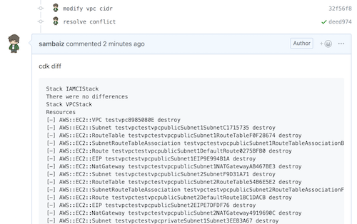
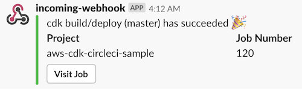

# aws-cdk-circleci-sample

## Features

- When create a PR, post results of `cdk diff` on there.

- When the branch is merged, run `cdk deploy`.

- Notify the result on Slack.

## Flow

1. push codes on a branch
2. create PR to the develop branch
3. post env=stg diff by CI
4. review and merge
5. create PR from develop to master
6. deploy with env=stg and post env=prd diff by CI
7. review and merge
8. deploy with env=prd by CI

## Settings

1. upload `cfn/iam-ci-user-stack.yaml` from AWS CloudFormation Console and get AccessKey/Secret from Outputs (Optional)
2. Set AWS Permissions and following environment variables to CircleCI

- ASSUME_ROLE_ARN
- GITHUB_TOKEN
- SLACK_WEBHOOK

## Article

[CDK/CircleCI/GitHubでAWSリソース管理リポジトリを作る - sambaiz-net](https://www.sambaiz.net/article/223/)
